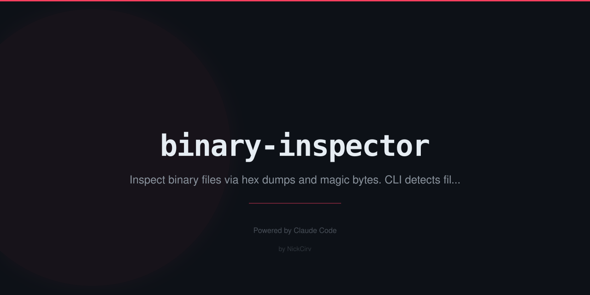

# binary-inspector

Inspect binary files from the command line. Hex dump, magic byte detection, entropy analysis, string extraction, byte frequency, and hex pattern search — zero dependencies.

```
binary-inspector v1.0.0  — hex dump, magic bytes, file type detection

USAGE
  binx <file> [options]
  binary-inspector <file> [options]

OPTIONS
  --hex              Hex dump (default if no other mode)
  --type             Detect file type from magic bytes
  --info             File info: size, permissions, entropy
  --strings          Find printable string sequences
  --freq             Byte frequency analysis (top 10)
  --search <hex>     Search for hex pattern (e.g. "FF D8 FF")
  --offset <n>       Start at byte offset N
  --length <n>       Read N bytes from offset
  --min-len <n>      Min string length for --strings (default: 4)
  --all              Run all analyses
  --json             Output full analysis as JSON
  --no-color         Disable color output
```

## Install

```sh
npm install -g binary-inspector
```

Or run without installing:

```sh
npx binary-inspector <file> [options]
```

## Usage

### Hex Dump

```sh
$ binx image.png

File: /path/to/image.png
────────────────────────────────────────────────────────────────────────

[ Hex Dump ]
  Showing 71 of 71 bytes

00000000  89 50 4e 47 0d 0a 1a 0a  00 00 00 0d 49 48 44 52  |.PNG........IHDR|
00000010  00 00 00 02 00 00 00 02  08 02 00 00 00 fd d4 9a  |................|
00000020  73 00 00 00 0e 49 44 41  54 78 9c 63 f8 0f 04 0c  |s....IDATx.c....|
00000030  00 00 00 11 00 01 c9 d6  c9 21 00 00 00 00 49 45  |.........!....IE|
00000040  4e 44 ae 42 60 82                                  |ND.B`.|
────────────────────────────────────────────────────────────────────────
```

### Magic Bytes / File Type Detection

30+ format signatures: PNG, JPEG, GIF, WebP, BMP, TIFF, PDF, ZIP, GZIP, BZIP2, XZ, TAR, RAR, 7-Zip, ELF, Mach-O (32/64/FAT), MP4, MOV, AVI, MP3, OGG, FLAC, WAV, SQLite, WASM, Java Class, RTF, ICO, and more.

```sh
$ binx /bin/ls --type

File: /bin/ls
────────────────────────────────────────────────────────────────────────

[ Magic Bytes / File Type ]
  Type: Mach-O FAT
  MIME: application/x-mach-binary
  Magic: CA FE BA BE
  Header (first 16 bytes): CA FE BA BE 00 00 00 02 01 00 00 07 00 00 00 03
────────────────────────────────────────────────────────────────────────
```

### File Info + Entropy

```sh
$ binx firmware.bin --info

File: /path/to/firmware.bin
────────────────────────────────────────────────────────────────────────

[ File Info ]
  Size:        256.00 KB (262144 bytes)
  Permissions: 644
  Entropy:     7.9943 / 8.0 — HIGH — likely encrypted or compressed
────────────────────────────────────────────────────────────────────────
```

Entropy interpretation:
- `< 5.0` — Low: text or structured data
- `5.0–7.5` — Medium: mixed content
- `> 7.5` — High: encrypted, compressed, or random data

### String Extraction

```sh
$ binx /bin/ls --strings --min-len 8

[ Strings ]
  Found 499 string sequences (min length: 8)

  000045a4  /usr/lib/dyld
  00004630  /usr/lib/libutil.dylib
  00004660  /usr/lib/libncurses.5.4.dylib
  00004698  /usr/lib/libSystem.B.dylib
  ...
```

### Byte Frequency Analysis

```sh
$ binx data.bin --freq

[ Byte Frequency (Top 10) ]
  Byte   Hex   Count       Pct    Bar
  ' '    20      4821    18.53%  █████████
  'e'    65      3102    11.92%  █████
  'a'    61      2891    11.11%  █████
  ...
```

### Hex Pattern Search

```sh
$ binx archive.zip --search "50 4B 03 04"

[ Hex Pattern Search ]
  Pattern: 50 4B 03 04
  Found 3 match(es):
  Offset: 0x00000000 (0)
  Offset: 0x00001234 (4660)
  Offset: 0x00005678 (22136)
```

### Byte Range Extraction

```sh
$ binx large.bin --hex --offset 1024 --length 256
```

### Full Analysis as JSON

```sh
$ binx image.png --all --json
{
  "file": "/path/to/image.png",
  "name": "image.png",
  "size": 71,
  "sizeHuman": "71 B",
  "permissions": "644",
  "magicType": "PNG",
  "mime": "image/png",
  "entropy": 4.6012,
  "entropyLevel": "low (text/structured)",
  "byteFrequency": [...],
  "strings": [...]
}
```

## Requirements

- Node.js >= 18
- Zero external npm dependencies

## License

MIT
